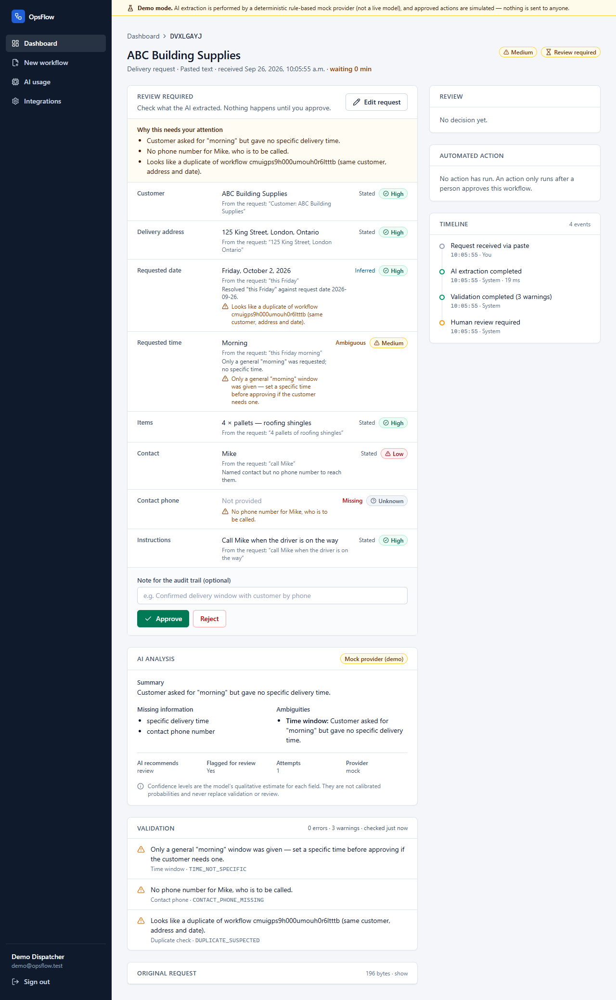
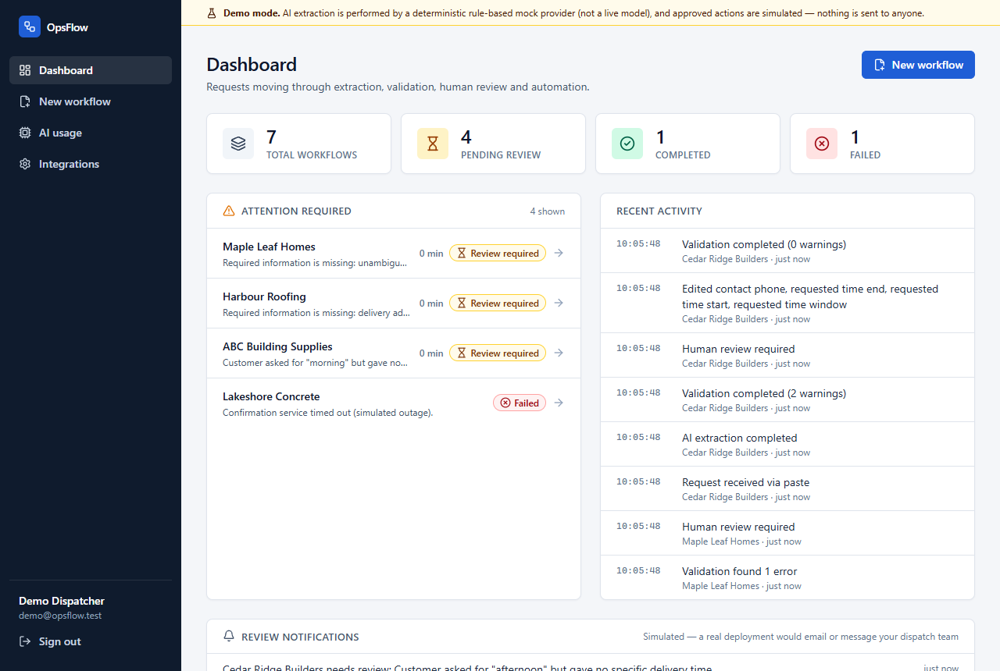
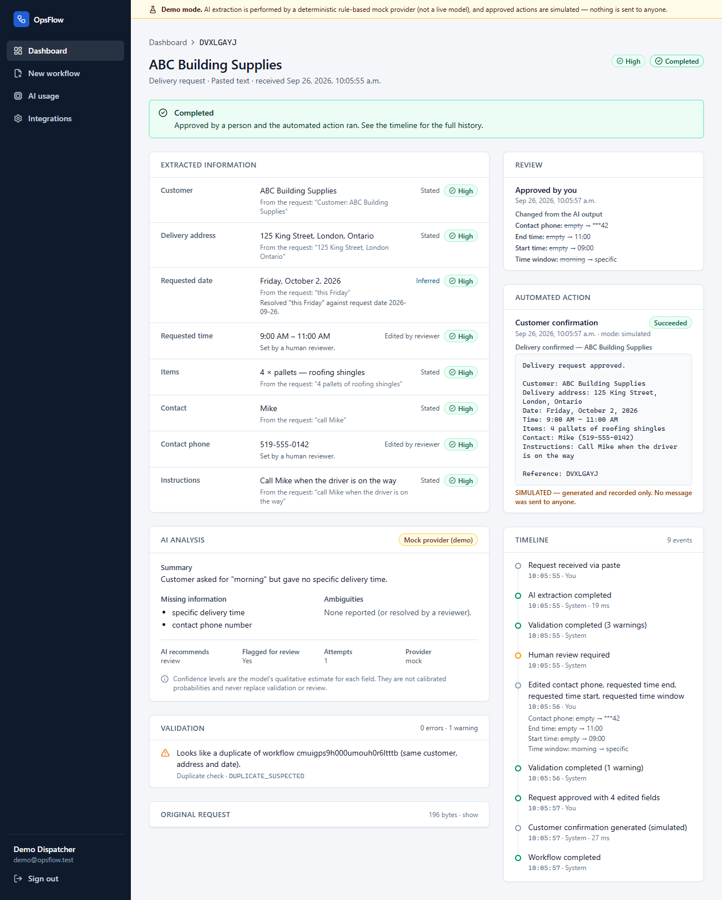
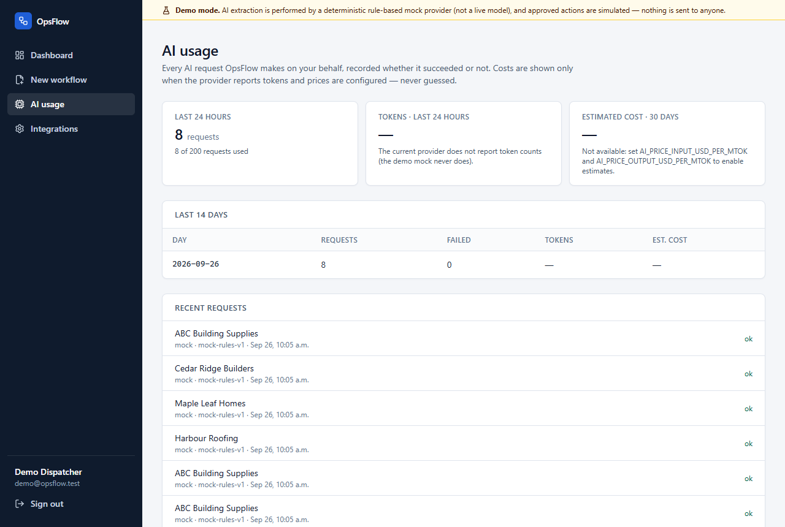
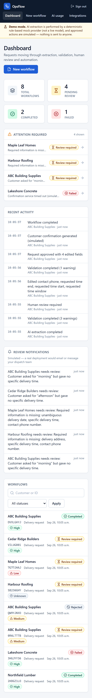
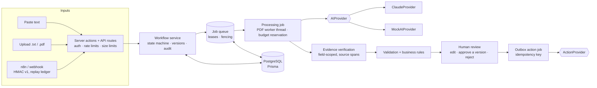

# OpsFlow

[](https://github.com/theswilliams/opsflow/actions/workflows/ci.yml)

**Turn messy business requests into structured, actionable workflows.**

OpsFlow is a workflow-automation platform for small and mid-sized businesses. It takes an unstructured request (an email, a pasted note, a PDF, or a webhook call), extracts structured data with an LLM, validates it deterministically, holds it for human review when anything is uncertain, and only after a person approves *the version they saw* runs an automated action — with a complete audit trail.

It is a portfolio project. It is engineered like a real system — durable background jobs, database-enforced invariants, a large test suite that runs against real PostgreSQL — and it was hardened after a written adversarial security audit (see [Security](#security-summary)). It is **not** production-ready, and [Status and limitations](#status-and-limitations) says exactly where it stops being a real system.



```text
Unstructured input → durable job → AI extraction → evidence verification → deterministic validation
        → human review (edit / approve a specific version / reject) → outbox action (idempotent) → audit trail
```

## Screenshots

All images are captured from the local demo with synthetic data (`scripts/screenshots.mjs`).

| | |
| --- | --- |
|  |  |
| **Dashboard** — what needs a person, and for how long it has waited | **Completed request** — what changed from the AI output, the simulated action, and the timeline |
|  |  |
| **AI usage** — spend is shown only when it can be known | **Responsive** down to phone width |

## The problem it solves

Operations teams receive work as free text: *"Can we get 4 pallets of shingles to 125 King Street this Friday morning? Call Mike when the truck's on the way."* Someone re-keys that into a dispatch system, guessing at what is missing. Naïve "ask an LLM to extract it" automation fails in the other direction: it confidently invents a delivery time and acts on it.

OpsFlow's design principle is that **the AI proposes, deterministic code checks, and a person decides.** The model must say what is *known*, *inferred*, *ambiguous* or *missing*, and back each claim with a quote that OpsFlow verifies itself; validation does not trust the model; and nothing consequential happens without a recorded human approval of the exact version that was reviewed.

## Features

- **Three inputs** — paste text, upload a `.txt`/`.pdf`, or POST a signed webhook (n8n-ready).
- **Durable background processing** — every slow step (PDF parsing, AI extraction, the customer action) is a leased, fenced, retried, sweeper-recovered job. A crash, deploy or platform timeout cannot strand a workflow.
- **Structured extraction with verified evidence** — strict typed schema, retries, timeouts, provider abstraction (Claude or a deterministic mock); every field's evidence is checked deterministically against the document and given a real source span.
- **Known / inferred / ambiguous / missing** per field, with qualitative confidence (High / Medium / Low / Unknown — *not* fake percentages).
- **Deterministic validation** — required fields, calendar dates, quantities, address structure, time ranges, phone format, indexed duplicate detection with normalised customer names.
- **Human-in-the-loop review** — correct any field, approve or reject. **Approval is bound to a version**: if someone else changed the request after you opened it, your approval is refused and you are asked to reload.
- **Outbox action with an idempotency key** — the customer confirmation is an outbox row with a deterministic idempotency key passed to the provider, so a retry after a lost commit does not send twice *provided the provider honours the key* (real email/SMS APIs do). The action is *simulated* in this repo; the contract is tested against a stand-in provider.
- **AI spend controls** — every request recorded (provider, model, tokens, estimated cost *only when knowable*), per-user daily/monthly budgets enforced atomically, an AI-usage page.
- **Audit log** — receipt, extraction, validation, edits, decisions, actions, rejected webhook calls. Guarded against UPDATE/DELETE/TRUNCATE by the database (with the honest limits in [SECURITY.md](docs/SECURITY.md#audit-log-what-is-and-is-not-promised)).
- **Dashboard** — KPIs, attention list with **ageing / overdue** indicators, review notifications (simulated), activity feed, filterable table. Responsive down to phone width.
- **Secure webhook + n8n** — HMAC-signed requests with the idempotency key inside the signature, durable replay ledger, per-tenant rate limits, importable n8n workflow.
- **Per-user data isolation** — every query is scoped to the signed-in user, and the database enforces owner consistency with composite foreign keys. (Each account is a single-user tenant; there are no teams or roles.)
- **Privacy controls** — data export, account deletion (anonymising tombstone), configurable retention purge — see [docs/DATA.md](docs/DATA.md).

## Architecture



| Layer | Location | Responsibility |
| --- | --- | --- |
| UI | `src/app`, `src/components` | Server components for reads; a few client components for forms. No business logic. |
| Server actions / API | `src/app/actions`, `src/app/api` | AuthN/Z, rate limiting, input parsing → service layer. |
| Workflow service | `src/lib/workflow` | State machine, approval boundary, audit writes, processing/execution jobs. |
| Jobs | `src/lib/jobs` | Queue, leases, fencing, worker loop, sweeper. |
| AI pipeline | `src/lib/ai` | Prompt, providers, strict schema, retry, evidence verification, usage budgets. |
| Validation | `src/lib/validation` | Pure, deterministic checks, normalisation and business rules. |
| Webhook | `src/lib/webhook` | Signature, credentials, handler. |
| Data | `prisma/` | Schema, migrations, DB-level safeguards, seed. |

More in [docs/ARCHITECTURE.md](docs/ARCHITECTURE.md).

## Technology

Next.js 16 (App Router, Server Actions) · React 19 · TypeScript (strict) · Tailwind CSS 4 · PostgreSQL · Prisma 7 (`@prisma/adapter-pg`) · Zod 4 · Anthropic SDK (tool use with a forced schema) · bcryptjs · unpdf (in a worker thread) · Vitest · ESLint · puppeteer-core (browser smoke test). Local Postgres via the `embedded-postgres` npm package (real PostgreSQL binaries) or Docker.

## Security (summary)

- **AuthN**: bcrypt (cost 12), DB-backed sessions, opaque `HttpOnly` / `SameSite=Lax` cookie, only a SHA-256 of the token stored, uniform-time login.
- **AuthZ**: every query includes `userId`; another tenant's resource is a 404. Composite FKs enforce owner consistency for every child table. Tested for IDOR across reads, mutations, export, usage and notifications.
- **Webhook**: per-user credentials (secret encrypted at rest), HMAC-SHA256 over `v1 · timestamp · idempotency-key · body`, durable replay/duplicate ledger, ±5 min / +60 s tolerance, constant-work auth, uniform 401s, per-credential **and** per-tenant limits, failure throttling that can only ever throttle the attacker's own address.
- **Approval integrity**: version-bound approval, frozen approved snapshot, live validation on the page.
- **Side effects**: outbox + idempotency key; leases and fencing so stale workers cannot overwrite newer state.
- **AI**: instructions/data separation, strict output schema, deterministic field-scoped evidence verification, pipeline-owned review decision, atomic per-user budgets.
- **Other**: nonce-based CSP (no `'unsafe-inline'` scripts), security headers, no `dangerouslySetInnerHTML`, Prisma parameterisation, PDF parsing isolated in a worker thread with timeout, redacting logger, no stack traces or provider errors to users.

A written adversarial audit of the first version reported 11 findings (2 critical, 2 high, 7 medium) plus 7 low-severity items. Seven of the eleven were **reproduced** against the original code with failing tests or scripts; the other four were **confirmed by code inspection**. All eleven were then fixed, each with regression tests, and the original exploits were re-run against the fixed build where practical. A follow-up review of the fixes (by the same author, so a self-review, not an independent one) found and fixed further problems. Findings, fixes and residual risks: [docs/SECURITY.md](docs/SECURITY.md).

## Local setup

Requirements: **Node.js 22.12 or newer** (developed and tested on 24; the test runner requires 22.12+) and npm. No Docker or PostgreSQL install is needed — `npm run db:start` runs a real PostgreSQL from an npm package.

```bash
git clone <repository-url> opsflow && cd opsflow
npm install
npm run setup        # creates .env with random secrets; prints the demo login
npm run db:start     # terminal 1: starts a local PostgreSQL (keep it running)
```

In a second terminal:

```bash
npm run db:deploy    # apply migrations
npm run db:seed      # demo data + a demo webhook credential (printed once)
npm run dev          # http://localhost:3000  (custom server + in-process job worker)
```

Production-style run: `npm run build && npm start` (listens on `localhost:3000` only; set `HOSTNAME_BIND=0.0.0.0` inside a container or behind a reverse proxy, and `PORT` to change the port). To keep AI/PDF work off the web process, set `OPSFLOW_WORKER=off` there and run `npm run worker` separately (same `.env`).

Sign in as `demo@opsflow.test` with the password printed by `npm run setup` (it is `DEMO_USER_PASSWORD` in `.env`). The demo account and its password exist only in your local database; there is no shared or hosted demo, and nothing in the repository is a real credential. Prefer Docker? `POSTGRES_PASSWORD=… docker compose up -d` and set `DATABASE_URL` accordingly.

### Environment variables

The full, commented list is in [`.env.example`](.env.example). The important ones:

| Variable | Required | Description |
| --- | --- | --- |
| `DATABASE_URL` | yes | PostgreSQL connection string. |
| `APP_ENCRYPTION_KEY` | yes | 32 random bytes, base64. Encrypts webhook secrets at rest. |
| `AI_PROVIDER` | no | `mock` (default) or `claude`. |
| `ANTHROPIC_API_KEY` | if `claude` | Never commit it. With `claude` and no key, processing fails clearly — it does not silently fall back to the mock. |
| `BUSINESS_TIMEZONE` | no | IANA zone used to resolve "today" and "Friday". **Validated at startup.** |
| `AI_DAILY_REQUEST_BUDGET`, `AI_DAILY_TOKEN_BUDGET`, `AI_MONTHLY_COST_BUDGET_USD`, `AI_PRICE_*` | no | Per-user AI ceilings and optional prices for cost estimates (0 = no limit for that ceiling). |
| `MAX_CREDENTIALS_PER_USER`, `WEBHOOK_KEY_LIMIT_PER_MIN`, `WEBHOOK_TENANT_LIMIT_PER_MIN` | no | Abuse controls. |
| `TRUSTED_PROXIES`, `TRUST_PROXY_HOPS` | no | Client-address trust model — read [SECURITY.md](docs/SECURITY.md#client-address-trust-model) before setting. |
| `RETENTION_DAYS` | no | Purge documents/extracted data this long after a workflow finishes (default 90; 0 disables). |
| `DEMO_USER_PASSWORD` | for seeding | Password of the seeded demo user (demo only). |
| `CSP_MODE` | no | `enforce` (default), `report-only` or `off`. |
| `OPSFLOW_WORKER` | no | `off` on the web process when `npm run worker` runs separately. |
| `JOB_LEASE_SECONDS`, `JOB_MAX_ATTEMPTS`, `PDF_TIMEOUT_MS` | no | Background-job and PDF-parsing limits. |
| `PORT`, `HOSTNAME_BIND` | no | Read by `server.mjs` from the shell environment (not from `.env`). |

Only `DATABASE_URL` and `APP_ENCRYPTION_KEY` are required to run; `npm run setup` generates both. Variables used only by tooling: `TEST_DATABASE_URL` (tests against an existing server), `SHADOW_DATABASE_URL` (the CI migration drift check), `CHROME_PATH` (browser scripts).

## Demo mode

With `AI_PROVIDER=mock` (the default) OpsFlow runs with no external services. A banner on every page says so, and each workflow's AI card is labelled "Mock provider (demo)". The mock is a deterministic rule-based parser — it is *not* a language model and is not presented as one; it reports no token usage, so its cost is shown as unknown rather than zero. Actions are always simulated: the confirmation is generated and recorded, never sent.

To use a real model: `AI_PROVIDER=claude` and set `ANTHROPIC_API_KEY`. (This path is covered by tests against a faked SDK client; see [Status and limitations](#status-and-limitations).)

Walkthrough: [docs/DEMO.md](docs/DEMO.md). To regenerate the screenshots in [`docs/screenshots/`](docs/screenshots) from the synthetic demo data: `DEMO_USER_PASSWORD=… node scripts/screenshots.mjs http://localhost:3000`.

## n8n integration

`POST /api/webhooks/workflow` accepts `{ "type": "delivery_request", "text": "…", "external_id": "…" }` signed with `X-OpsFlow-Key-Id`, `X-OpsFlow-Timestamp` and `X-OpsFlow-Signature: sha256=hex(HMAC(secret, "v1" LF timestamp LF idempotency-key LF body))`. Processing is a durable background job, so **always poll** `GET /api/webhooks/workflow/:id` (signed the same way) for the outcome. An importable workflow is in [`n8n/opsflow-workflow.json`](n8n/opsflow-workflow.json). Full guide: [docs/N8N.md](docs/N8N.md).

```bash
OPSFLOW_KEY_ID=ofk_… OPSFLOW_SECRET=ofs_… node scripts/send-webhook.mjs http://localhost:3000
OPSFLOW_KEY_ID=ofk_… OPSFLOW_SECRET=ofs_… node scripts/verify-audit-fixes.mjs http://localhost:3000   # re-run the audit's replay exploit (F1)
# The client-isolation exploit (F2) needs distinct client addresses: restart the server with TRUSTED_PROXIES=127.0.0.1,::1
# in its environment and add --proxied to the command above. Without --proxied the F2 checks are skipped, not failed.
```

## Testing

```bash
npm test                    # unit + integration tests; starts a throw-away PostgreSQL automatically
npm run lint
npm run typecheck
npm run check:migrations    # no migration may drop a protected database safeguard
npm run build
npm run check               # lint + typecheck + tests + build
DEMO_USER_PASSWORD=… node scripts/e2e-smoke.mjs http://localhost:3000   # real-browser smoke test (needs Chrome/Edge + a running seeded server)
```

**Current results:** **347 tests in 24 files pass** (Vitest against real PostgreSQL, run on every push in CI), plus lint, typecheck, production build, the migration-drift check and `npm audit` (0 known vulnerabilities). Code-coverage percentage is not measured.

Integration tests run against real PostgreSQL (started via `embedded-postgres`, or set `TEST_DATABASE_URL` to use an existing server — CI does this with a service container). Suites cover: AI parsing, evidence verification (adversarial fixtures), validation, normalisation and large-dataset duplicate detection, the state machine, the approval boundary and versioning, edits, action outbox/idempotency, job recovery/leases/fencing/concurrency, PDF isolation, AI budgets, webhook auth/replay/idempotency/rate-limits/limits, client-address trust, sessions, uploads, privacy (export/deletion/retention), DB integrity and audit-log guards, the n8n signing code, the seed, and security regressions. CI additionally replays all migrations into a scratch database and diffs them against `schema.prisma`.

## Design decisions

The important ones (full list in [docs/DECISIONS.md](docs/DECISIONS.md)):

- **Nothing auto-executes.** Even a perfectly clean request waits for one-click human approval — of a specific version.
- **The model never certifies itself.** Evidence is verified deterministically and the pipeline, not the model, decides what needs review.
- **Slow work is a durable job**, not an HTTP request that must survive: leases, fencing tokens, atomic finalisation and a sweeper mean no workflow can be left in limbo.
- **Side effects go through an outbox with an idempotency key**, because a unique index cannot prevent an email that was already sent.
- **Invariants live in the database** where Prisma can express them (and are guarded by tests/CI where it cannot).
- **Qualitative confidence**, because the model's self-reported numbers are not calibrated.
- **Mock provider behind an interface** rather than canned responses in the UI.

## Status and limitations

Be honest about what this is: a well-tested reference implementation, **not production-ready**.

| | What |
| --- | --- |
| **Verified** (by tests, or by actually running it) | Everything in [Features](#features) that runs locally, on real PostgreSQL: the workflow state machine, version-bound approval (also driven in a real browser with two tabs), job recovery after a killed process, webhook signing/replay/rate-limit behaviour over HTTP, PDF isolation, AI budgets, evidence verification, duplicate detection, authorisation between users, the strict CSP (real browser, no violations), export/deletion/retention, and that migrations match `schema.prisma`. |
| **Implemented but simulated** | The customer confirmation action (generated and recorded, never sent), review notifications, and the demo AI provider (a deterministic rule-based parser, not a language model). |
| **Implemented but not tested live** | The Claude provider (tested against a faked SDK client only — no API key was used) and the importable n8n workflow (validated structurally; its signing code is exercised against the real handler, but it was never imported into a running n8n). |
| **Not built — needed for real use** | Distributed rate limiting (limits are in-memory, per process); password reset, email verification and MFA (they need a real email channel; a simulated one would be a backdoor); a real email/SMS provider; OCR (scanned images are refused); teams, roles and a shared review queue; workflow types beyond delivery requests. |

Other things to know:

- **The audit log is guarded, not owner-proof or tamper-evident** — the database owner can drop the triggers.
- **AI token/cost ceilings can overshoot** by the requests in flight; request-count ceilings cannot.
- **No housekeeping for bookkeeping tables:** finished job rows, webhook receipts, AI-usage rows and audit events are kept indefinitely (only documents and extracted data are purged), so they grow with use.
- **Registration is open** and reveals whether an email address is registered; distributed password guessing is slowed only by bcrypt.
- **Duplicate detection is exact on normalised keys**, so look-alike names (for example homoglyphs) are not matched.
- **Personal data in documents is sent to the AI provider** when `AI_PROVIDER=claude` — an operator decision with privacy implications ([docs/DATA.md](docs/DATA.md)).
- **Dependencies:** `npm audit` reports no known vulnerabilities. Newer major versions of ESLint, TypeScript and Prisma exist and were deliberately not adopted in this pass.
- **Not measured:** code coverage percentage.

## Project layout

```text
prisma/            schema, migrations (incl. guarded hand-written safeguards), seed
src/app/           routes: (auth), (app) dashboard / workflows / usage / settings, api/
src/components/    UI components
src/lib/ai/        provider interface, Claude + mock providers, prompt, schema, pipeline, evidence, usage
src/lib/jobs/      queue, leases, worker loop, sweeper
src/lib/validation deterministic validation, normalisation, business rules
src/lib/workflow/  state machine, service, processing/execution jobs, queries, audit, action providers
src/lib/webhook/   signature, credentials, handler
src/lib/net/       client-address trust model
src/lib/privacy/   export, deletion, retention
src/proxy.ts       per-request nonce CSP
server.mjs         custom server: real peer address (MAC-protected) for rate limiting
tests/             Vitest suites (real PostgreSQL)
docs/              architecture, security, data handling, AI pipeline, n8n, demo, decisions, screenshots/
n8n/               importable workflow
scripts/           env setup, dev database, worker, webhook sender, exploit re-runner, e2e smoke test, screenshots, migration guard
```

## License

No license has been chosen yet, so by default all rights are reserved: the code is visible for review but is not licensed for reuse.
