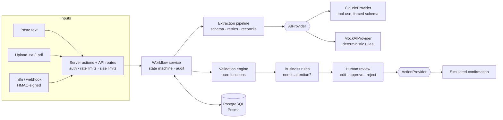

# OpsFlow

**Turn messy business requests into structured, actionable workflows.**

OpsFlow is a workflow-automation platform for small and mid-sized businesses. It takes an unstructured request (an email, a pasted note, a PDF, or a webhook call), extracts structured data with an LLM, validates it deterministically, holds it for human review when anything is uncertain, and only after a person approves it runs an automated action — with a complete audit trail.

It is a portfolio project. It is built like a real system, and this README is explicit about where it stops being one (see [Limitations](#limitations)).

```text
Unstructured input → AI extraction → deterministic validation → business rules
        → human review (edit / approve / reject) → automated action → audit trail
```

## The problem it solves

Operations teams receive work as free text: *"Can we get 4 pallets of shingles to 125 King Street this Friday morning? Call Mike when the truck's on the way."* Someone re-keys that into a dispatch system, guessing at what is missing. Naïve "ask an LLM to extract it" automation fails in the other direction: it confidently invents a delivery time and acts on it.

OpsFlow's design principle is that **the AI proposes, deterministic code checks, and a person decides.** The model must say what is *known*, *inferred*, *ambiguous* or *missing*; validation does not trust it; and nothing consequential happens without a recorded human approval.

## Features

- **Three inputs** — paste text, upload a `.txt`/`.pdf`, or POST a signed webhook (n8n-ready).
- **Structured extraction** — strict typed schema, retries, timeouts, output validation, prompt-injection defences, provider abstraction (Claude or a deterministic mock).
- **Known / inferred / ambiguous / missing** per field, with qualitative confidence (High / Medium / Low / Unknown — *not* fake percentages).
- **Deterministic validation** — required fields, calendar dates, quantities, address structure, time ranges, phone format, duplicate detection.
- **Human-in-the-loop review** — correct any extracted field, approve or reject; every edit is recorded and diffed against the original AI output.
- **Workflow state machine** — `RECEIVED → PROCESSING → EXTRACTED → VALIDATING → REVIEW_REQUIRED → APPROVED → EXECUTING → COMPLETED`, plus `FAILED` and `REJECTED`, with compare-and-set transitions.
- **Safe automated action** — generates a customer confirmation in *simulated* mode (nothing is sent), behind an `ActionProvider` interface.
- **Audit log** — append-only (enforced by a database trigger), covering receipt, extraction, validation, edits, decisions, actions and rejected webhook calls.
- **Dashboard** — KPIs, "attention required", recent activity, filterable/paginated table. Responsive down to phone width.
- **Secure webhook + n8n** — HMAC-signed requests, replay protection, idempotency, rate limits, size limits, per-tenant credentials, importable n8n workflow.
- **Multi-tenant isolation** — every query is user-scoped, and the database enforces it with composite foreign keys.

## Architecture



| Layer | Location | Responsibility |
| --- | --- | --- |
| UI | `src/app`, `src/components` | Server components for reads; a few client components for forms. No business logic. |
| Server actions / API | `src/app/actions`, `src/app/api` | AuthN/Z, rate limiting, input parsing → calls the service layer. |
| Workflow service | `src/lib/workflow` | State machine, approval boundary, audit writes, queries. |
| AI pipeline | `src/lib/ai` | Prompt, providers, strict schema, retry, reconciliation. |
| Validation | `src/lib/validation` | Pure, deterministic checks and business rules. |
| Webhook | `src/lib/webhook` | Signature verification, credentials, idempotency, handler. |
| Data | `prisma/` | Schema, migrations, DB-level constraints, seed. |

More in [docs/ARCHITECTURE.md](docs/ARCHITECTURE.md).

## Technology

Next.js 16 (App Router, Server Actions) · React 19 · TypeScript (strict) · Tailwind CSS 4 · PostgreSQL · Prisma 7 (`@prisma/adapter-pg`) · Zod 4 · Anthropic SDK (tool use with a forced schema) · bcryptjs · unpdf (PDF text) · Vitest · ESLint. Local Postgres via the `embedded-postgres` npm package (real PostgreSQL binaries) or Docker.

## AI architecture (summary)

1. **Extraction** — the document is sent inside a delimited, explicitly-untrusted `<document>` block; instructions live only in the system prompt. Claude must answer through a `record_extraction` tool whose JSON Schema is generated from the same Zod schema used to validate the reply.
2. **Validation of the model's output** — strict schema (unknown fields are rejected, not ignored), then *reconciliation*: cited evidence must actually appear in the source text, and status/value contradictions are repaired and confidence downgraded.
3. **Retries** — one retry with structural feedback (paths only, never model-produced values), timeouts per attempt, failures surface as a `FAILED` workflow with a generic message.
4. **Deterministic validation + business rules** — independent of the model. A confident-but-wrong extraction still fails (`DATE_IN_PAST`, `QUANTITY_INVALID`, …).
5. **Confidence** — a qualitative *AI confidence estimate* per field. It is not a calibrated probability and is never used alone to skip review.
6. **Human approval** — a hard boundary. Execution requires a persisted approval record independent of the status column.
7. **Action** — simulated, recorded, auditable.

Details: [docs/AI_PIPELINE.md](docs/AI_PIPELINE.md).

## Security (summary)

- **AuthN**: bcrypt (cost 12), DB-backed sessions, opaque `HttpOnly` / `SameSite=Lax` cookie, only a SHA-256 of the token stored, uniform-time login, login/register rate limits.
- **AuthZ**: every query includes `userId`; another tenant's resource is a 404. The DB enforces owner consistency with composite FKs. Tested for IDOR on every read and mutation.
- **Webhook**: per-user credentials (secret encrypted with AES-256-GCM at rest), HMAC-SHA256 over `timestamp.body`, ±5 min tolerance, constant-time compare, replay → idempotent, body cap, per-IP and per-key limits, uniform 401s.
- **Prompt injection**: document = data; strict output schema; evidence verification; nothing executes without human approval.
- **Other**: CSP and security headers, no `dangerouslySetInnerHTML`, Prisma parameterisation, upload content sniffing, redacting logger, no stack traces or provider errors to users, append-only audit trail.

Details and threat model: [docs/SECURITY.md](docs/SECURITY.md).

## Local setup

Requirements: Node.js 20+ (developed and tested on 24), npm. No Docker or Postgres install needed.

```bash
git clone <this repo> opsflow && cd opsflow
npm install
npm run setup        # creates .env with random secrets; prints the demo login
npm run db:start     # terminal 1: starts a local PostgreSQL (keep it running)
```

In a second terminal:

```bash
npm run db:deploy    # apply migrations
npm run db:seed      # demo data + a demo webhook credential (printed once)
npm run dev          # http://localhost:3000
```

Sign in as `demo@opsflow.test` with the password printed by `npm run setup` (it is `DEMO_USER_PASSWORD` in `.env`).

Prefer Docker? `POSTGRES_PASSWORD=… docker compose up -d` and set `DATABASE_URL` accordingly.

### Environment variables

| Variable | Required | Description |
| --- | --- | --- |
| `DATABASE_URL` | yes | PostgreSQL connection string. |
| `APP_ENCRYPTION_KEY` | yes | 32 random bytes, base64. Encrypts webhook secrets at rest. |
| `APP_URL` | no | Public base URL (used in webhook responses). Default `http://localhost:3000`. |
| `AI_PROVIDER` | no | `mock` (default) or `claude`. |
| `ANTHROPIC_API_KEY` | if `claude` | Never commit it. The app refuses to start extraction with `claude` and no key — it does not silently fall back to the mock. |
| `ANTHROPIC_MODEL` | no | Default `claude-sonnet-5`. |
| `BUSINESS_TIMEZONE` | no | IANA zone used to resolve "today" and "Friday". Default `America/Toronto`. |
| `DEMO_USER_PASSWORD` | for seeding | Password of the seeded demo user. |
| `TRUST_PROXY` | no | `true` only behind a reverse proxy that overwrites `X-Forwarded-For`. |

## Demo mode

With `AI_PROVIDER=mock` (the default) OpsFlow runs with no external services. A banner on every page says so, and each workflow's AI card is labelled "Mock provider (demo)". The mock is a deterministic rule-based parser — it is *not* a language model and is not presented as one. Actions are always simulated: the confirmation is generated and recorded, never sent.

To use a real model: `AI_PROVIDER=claude` and set `ANTHROPIC_API_KEY`. (This path is covered by tests against a faked SDK client; see [Limitations](#limitations).)

Walkthrough: [docs/DEMO.md](docs/DEMO.md).

## n8n integration

`POST /api/webhooks/workflow` accepts `{ "type": "delivery_request", "text": "…", "external_id": "…" }` signed with `X-OpsFlow-Key-Id`, `X-OpsFlow-Timestamp` and `X-OpsFlow-Signature: sha256=hex(HMAC(secret, "<timestamp>.<raw body>"))`. `GET /api/webhooks/workflow/:id` (signed the same way over an empty body) lets n8n poll for the review outcome. An importable workflow is in [`n8n/opsflow-workflow.json`](n8n/opsflow-workflow.json). Full guide: [docs/N8N.md](docs/N8N.md).

Smoke test from the command line:

```bash
OPSFLOW_KEY_ID=ofk_… OPSFLOW_SECRET=ofs_… node scripts/send-webhook.mjs http://localhost:3000
```

## Testing

```bash
npm test             # 130 tests; starts a throw-away PostgreSQL automatically
npm run lint
npm run typecheck
npm run build
npm run check        # all of the above
```

Integration tests run against real PostgreSQL (started via `embedded-postgres`, or set `TEST_DATABASE_URL` to use an existing server — CI does this with a service container). Suites cover AI parsing, validation, the state machine, the approval boundary, edits, failure/retry, tenant isolation, webhook auth/idempotency/limits, sessions, uploads, the n8n signing code, the seed, and security regressions.

## Design decisions

The important ones (full list in [docs/DECISIONS.md](docs/DECISIONS.md)):

- **Nothing auto-executes.** Even a perfectly clean request waits for one-click human approval. Auto-approval policies are a product decision, not a default.
- **Validation is separate from the AI** and re-run server-side at approval time; the stored result is never trusted.
- **Qualitative confidence**, because the model's self-reported numbers are not calibrated.
- **Approval is checked twice** — status *and* a persisted `Review` row — so a forged status column cannot trigger execution.
- **Compare-and-set state transitions** and a partial unique index make double-approval and double-execution impossible even under concurrency (tested).
- **Signature-as-implicit-idempotency-key**, so a replayed webhook returns the original workflow.
- **Mock provider behind an interface** rather than canned responses in the UI.

## Limitations

Be honest about what this is:

- **Not production-ready.** It is a well-tested reference implementation.
- **The Claude provider has not been exercised against the live API** in this repository (no API key was available). It is unit-tested against a faked SDK client, including tool-forcing, prompt structure and error mapping. Expect to tune the prompt against real traffic.
- **The n8n workflow JSON was not imported into a running n8n.** It is validated structurally, and its signing code is executed in tests against the real webhook handler, but node parameter shapes can drift between n8n versions.
- **Rate limiting is in-memory** (single instance). Multi-instance deployments need a shared store.
- **No OCR.** Scanned images are detected and rejected with an explanation; the extractor is a clear extension point.
- **Simulated actions only.** No real email/SMS integration.
- **One workflow type** (delivery requests). Adding another means a new schema, validator and action.
- **No password reset, email verification, MFA or account deletion.**
- **Single-user tenants** — no teams/roles yet, so "reviewer" and "owner" are the same person.
- **The audit trail is append-only at the application and trigger level**, not cryptographically tamper-evident.
- The CSP allows `'unsafe-inline'` scripts (required by Next.js hydration without nonces).

## Project layout

```text
prisma/            schema, migrations (incl. hand-written constraints), seed
src/app/           routes: (auth), (app) dashboard / workflows / settings, api/
src/components/    UI components
src/lib/ai/        provider interface, Claude + mock providers, prompt, schema, pipeline
src/lib/validation deterministic validation + business rules
src/lib/workflow/  state machine, service, queries, audit, action providers
src/lib/webhook/   signature, credentials, handler
tests/             Vitest suites (real PostgreSQL)
docs/              architecture, security, AI pipeline, n8n, demo, decisions
n8n/               importable workflow
scripts/           env setup, dev database, webhook sender, n8n generator
```

## License

Portfolio project — all rights reserved unless a license is added.
