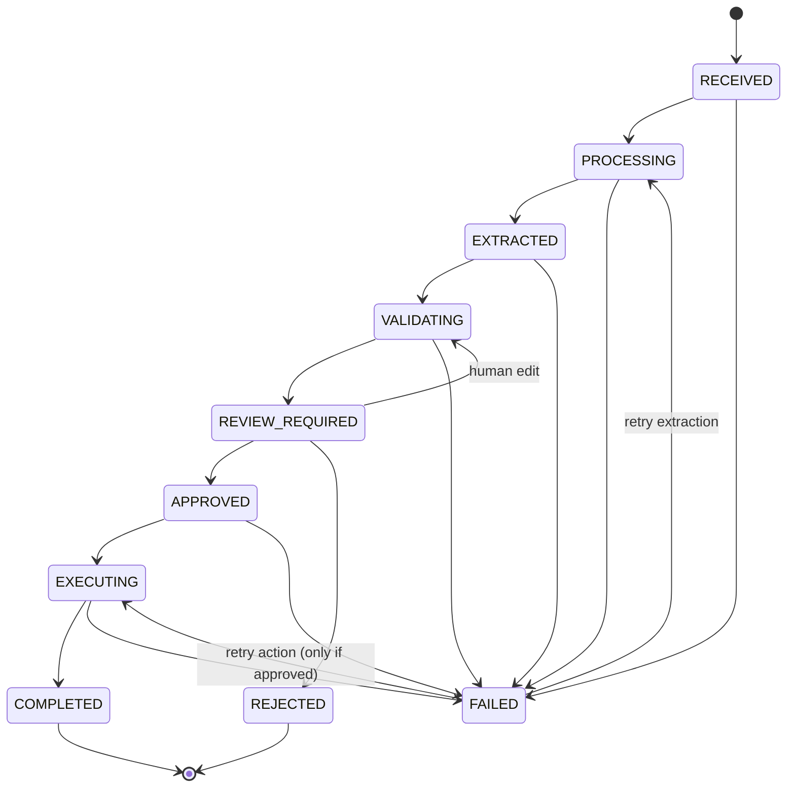

# Architecture

## Shape of the system

OpsFlow is a single Next.js application (App Router) with a PostgreSQL database. There is no separate API server: server components read through the query layer, and mutations are Server Actions or Route Handlers that call the same service layer.

```text
Browser ──► Server Component (reads)        ─┐
        ──► Server Action (mutations)        ├─► workflow/service.ts ─► Prisma ─► PostgreSQL
n8n     ──► Route Handler /api/webhooks/*   ─┘        │
                                                      ├─► ai/extract.ts ─► AIProvider (Claude | Mock)
                                                      ├─► validation/*   (pure functions)
                                                      └─► ActionProvider (simulated)
```

Rules that keep it clean:

- **No business logic in components.** Components render props; forms call actions; actions parse input and delegate.
- **Services take their collaborators as arguments** (`WorkflowDeps`: db, AI provider, action provider, clock, timezone). Production wiring is `defaultDeps()`; tests inject fakes and a fixed clock.
- **External systems sit behind interfaces**: `AIProvider`, `ActionProvider`. Neither the state machine nor the validators know which implementation is in use.
- **Validation is pure**: `validateDelivery(fields, ctx)` has no I/O. Duplicate candidates are looked up by the service and passed in.

## Request lifecycle



`state-machine.ts` is a lookup table plus `assertTransition`. The service performs each change with `UPDATE … WHERE id = ? AND userId = ? AND status = <expected>` and treats `count ≠ 1` as a conflict, so concurrent requests cannot both win.

### What happens on submit

1. `createWorkflow` — one transaction: `Workflow` (RECEIVED), `WorkflowInput`, audit event. An optional idempotency key is unique per user.
2. `processWorkflow` — `PROCESSING`; run the extraction pipeline; store `ExtractedData` (the validated model output is kept immutable in `aiOutput`; a working copy lives in `fields`/`fieldStatus`); `EXTRACTED → VALIDATING`.
3. `validateAndRoute` — deterministic validation, business rules (`decideReview`), store `ValidationResult`, set `needsAttention` / `overallConfidence` / `attentionReason`, move to `REVIEW_REQUIRED`.
4. A person edits (`REVIEW_REQUIRED → VALIDATING → REVIEW_REQUIRED`, re-validated), then approves or rejects.
5. `approveWorkflow` — re-runs validation *now* (never trusting a stored result), records the `Review` with the diff against the AI output, then `executeApprovedWorkflow` runs the action and completes or fails the workflow.

Failures never leave a workflow stuck in a transient state: extraction/validation problems become `FAILED` with a user-safe `failureReason`; action problems record a failed `WorkflowAction` and `FAILED`. `FAILED` workflows can be retried from the UI.

## Data model

```text
User ─┬─ Session            (tokenHash unique)
      ├─ ApiCredential      (keyId, AES-GCM encrypted secret, revokedAt)
      └─ Workflow ─┬─ WorkflowInput     1:1  (text, hash, size, file name)
                   ├─ ExtractedData     1:1  (aiOutput | fields | fieldStatus | ambiguities …)
                   ├─ ValidationResult  1:N  (history; latest is current)
                   ├─ Review            1:1  (decision, comment, changes)  ← unique index
                   ├─ WorkflowAction    1:N  (SUCCEEDED at most once)      ← partial unique index
                   └─ AuditEvent        1:N  (append-only)                 ← UPDATE trigger
```

Database-level guarantees (not just application checks):

| Guarantee | Mechanism |
| --- | --- |
| A child row's owner equals its workflow's owner | Composite FK `(workflowId, userId) → Workflow(id, userId)` on every child table |
| At most one successful action per workflow | Partial unique index `WHERE status = 'SUCCEEDED'` |
| At most one review decision per workflow | Unique index on `Review(workflowId)` |
| Audit events cannot be modified | `BEFORE UPDATE` trigger raises an exception |
| Idempotency keys unique per user | `UNIQUE (userId, idempotencyKey)` + length `CHECK` |
| Lower-case emails | `CHECK (email = lower(email))` |

The hand-written parts live in `prisma/migrations/*_init` and `*_audit_append_only` because Prisma's schema language cannot express them. `prisma migrate diff` therefore reports the `Review` unique index as "extra" — that is expected.

## Frontend

- Server components fetch through `workflow/queries.ts` (always scoped by `userId`).
- Client components are limited to interactive pieces: form submit buttons (`useFormStatus`), the review panel (edit toggle, items editor, approve/reject), tabs, navigation highlighting, credential form.
- Layout is responsive: sidebar on desktop, top bar with horizontal nav on mobile; the workflow table becomes a card list below the `lg` breakpoint.
- Accessibility: landmark structure, skip link, labelled controls, `aria-current`, `role="tablist"` with arrow-key navigation, `role="alert"` for errors, status conveyed by text and icon (never colour alone), visible focus rings, reduced-motion support.

## Observability

`lib/logger.ts` emits one JSON line per event with a redaction pass (secrets, tokens, document text, contact data are masked; long strings truncated). Workflow events log `workflowId`, `event`, `durationMs`, `result`, and an error *category* — not the document. The audit table is the business-facing record; logs are for operators.
