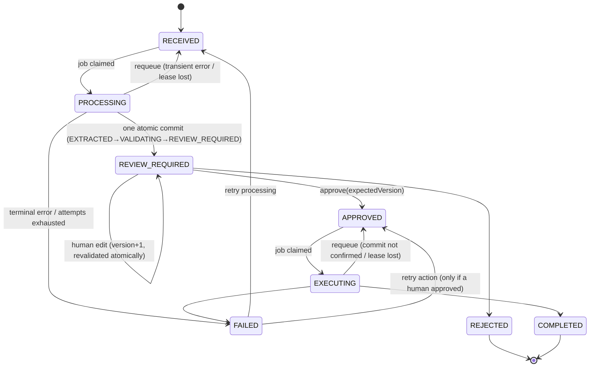

# Architecture

## Shape of the system

OpsFlow is a single Next.js application (App Router) with a PostgreSQL database. There is no separate API server: server components read through the query layer, mutations are Server Actions or Route Handlers that call the same service layer, and slow work runs as **durable jobs** executed by a worker loop (in-process by default, or `npm run worker`).

```text
Browser ──► Server Component (reads)        ─┐
        ──► Server Action (mutations)        ├─► workflow/service.ts ─► Prisma ─► PostgreSQL
n8n     ──► Route Handler /api/webhooks/*   ─┘        │  create/edit/approve/reject/retry
                                                      ▼
                                          Job queue (PostgreSQL, leases)
                                                      │  claimed by inline request, worker loop, or sweeper
                        ┌─────────────────────────────┴───────────────────────────┐
              processing.ts (PROCESS_WORKFLOW)                          execution.ts (EXECUTE_ACTION)
   PDF worker thread → AIProvider → evidence verification →     outbox row → ActionProvider(idempotency key) →
   validation → one atomic commit                                one atomic commit
```

Rules that keep it clean:

- **No business logic in components.** Components render props; forms call actions; actions parse input and delegate.
- **Services take their collaborators as arguments** (`WorkflowDeps`: db, AI provider *factory*, action provider, clock, time zone, budgets, lease settings). Production wiring is `defaultDeps()`; tests inject fakes and a fixed clock. The AI provider is a **factory** (`ai: () => AIProvider`) so a misconfiguration surfaces as an explicit error where it is used — never as an `undefined` cast to a provider.
- **External systems sit behind interfaces**: `AIProvider`, `ActionProvider` (whose `execute` must be idempotent on the key it is given).
- **Validation is pure**: `validateDelivery(fields, ctx)` has no I/O. The duplicate lookup is separate (`findDuplicates`).

## Request lifecycle



`state-machine.ts` is a lookup table plus `assertTransition`/`assertPath`. Persisted changes are compare-and-set (`UPDATE … WHERE id AND userId AND status = <expected>`; `count ≠ 1` means someone else won). Only `PROCESSING` and `EXECUTING` are long-lived working states, and both are protected by a job lease.

### What happens on submit

1. `createWorkflow` — one transaction: `Workflow` (RECEIVED), `WorkflowInput`, the `PROCESS_WORKFLOW` **job**, audit event and (webhook only) the `WebhookReceipt`. There is no window where a workflow exists without a job.
2. The submitting request gives its own job a head start (`runJobInline`, up to `inlineTimeoutMs`); the response never depends on it finishing. The worker loop and the sweeper guarantee progress if it does not.
3. `processWorkflowJob` — `RECEIVED → PROCESSING` (fenced by the lease); PDF bytes (if any) are parsed in an isolated worker thread; the AI is called with a *reserved* budget slot; then **one transaction** commits extraction data, validation result, the status change, audit events, the notification and job completion.
4. A person edits (`editWorkflowFields`: fields, version bump, validation and audit in one transaction guarded by `version`), then approves or rejects.
5. `approveWorkflow(expectedVersion)` — re-validates now, then in one transaction: `REVIEW_REQUIRED → APPROVED` *if the version still matches*, the `Review` with a frozen snapshot, the **outbox** `WorkflowAction` (`PENDING`, deterministic idempotency key) and the `EXECUTE_ACTION` job.
6. `executeActionJob` — `EXECUTING` (durable) → provider call with the idempotency key → commit `SUCCEEDED` + `COMPLETED`.

### Recovery (no state in limbo)

`sweepStuckWork` (every 30 s in the worker loop) re-queues jobs whose lease expired (or fails them once `attempts` reach `maxAttempts`, moving the workflow to an explicit `FAILED` with a Retry), and re-enqueues workflows in a working state that have no live job. Handlers retry transient failures with backoff up to `JOB_MAX_ATTEMPTS`; deterministic failures (bad PDF, budget exhausted, misconfigured provider, malformed AI output) fail immediately. `Retry` is idempotent and also repairs a stalled `RECEIVED`/`APPROVED` workflow.

## Data model

```text
User ─┬─ Session            (tokenHash unique)
      ├─ ApiCredential      (keyId, AES-GCM encrypted secret, revokedAt)
      ├─ AiUsage / Notification
      └─ Workflow ─┬─ WorkflowInput     1:1  (text, hash, size, rawBytes until parsed)
                   ├─ ExtractedData     1:1  (aiOutput | fields | fieldStatus (+verified, span) | ambiguities …)
                   ├─ ValidationResult  1:N  (history; latest is current)
                   ├─ Review            1:1  UNIQUE(workflowId)         (decision, approvedVersion, approvedFields)
                   ├─ WorkflowAction    1:1  UNIQUE(workflowId,type)    (outbox; UNIQUE idempotencyKey)
                   ├─ Job               1:N  UNIQUE(workflowId,type)    (queue, lease, fencing token)
                   ├─ WebhookReceipt    1:N  UNIQUE(userId,signatureHash)
                   └─ AuditEvent        1:N  (guarded: no UPDATE/DELETE/TRUNCATE; FKs RESTRICT)
```

Database-level guarantees (not just application checks):

| Guarantee | Mechanism | Declared in |
| --- | --- | --- |
| A child row's owner equals its workflow's owner | Composite FK `(workflowId, userId) → Workflow(id, userId)` | `schema.prisma` |
| One review per workflow; one action row per workflow (and per idempotency key); one job per (workflow, type); one receipt per signature | `@unique` / `@@unique` | `schema.prisma` |
| Replay of a signed webhook cannot create a second workflow | `WebhookReceipt` unique + advisory-locked creation | `schema.prisma` + `service.ts` |
| Optimistic approval | `Workflow.version` + `UPDATE … WHERE version = ?` | `service.ts` |
| Audit events cannot be modified or deleted; audit is never a cascade side effect | Triggers + `RESTRICT` FKs | hand-written migration (guarded) |
| Lower-case emails; key/attempt/version sanity | `CHECK` constraints | hand-written migration (guarded) |

Everything Prisma can express is in `schema.prisma`; the rest is protected by `tests/db-integrity.test.ts`, `scripts/check-migrations.mjs` and a CI schema↔migrations drift check.

## Frontend

- Server components fetch through `workflow/queries.ts` (always scoped by `userId`).
- Client components are limited to interactive pieces: submit buttons (`useFormStatus`), the review panel (edit toggle, items editor, approve/reject — every form carries the `version` it was rendered with), tabs, navigation, credential/deletion forms, and `AutoRefresh` (polls while work is in flight, for at most 5 minutes).
- The **review page recomputes validation at load**, shows how long a request has been waiting (ageing: >24 h warns, >72 h "Overdue"), and a stale-version error becomes a "Load the latest version" prompt.
- The dashboard has attention, activity, **review notifications** (simulated) and a filterable table; **AI usage** shows requests/tokens/estimated cost with budgets; Integrations holds credentials, data export and account deletion.
- Layout is responsive; accessibility: landmarks, skip link, labelled controls, `aria-current`, tablist keyboard support, `role="alert"`, status by text+icon.
- The CSP is per-request with a nonce (`src/proxy.ts`), so every page renders dynamically.

## Observability

`lib/logger.ts` emits one JSON line per event with a redaction pass. Workflow events log `workflowId`, `event`, `durationMs`, `attempt` and an error *category* — not the document. The audit table is the business-facing record; `Job.lastError` and logs are for operators only.
